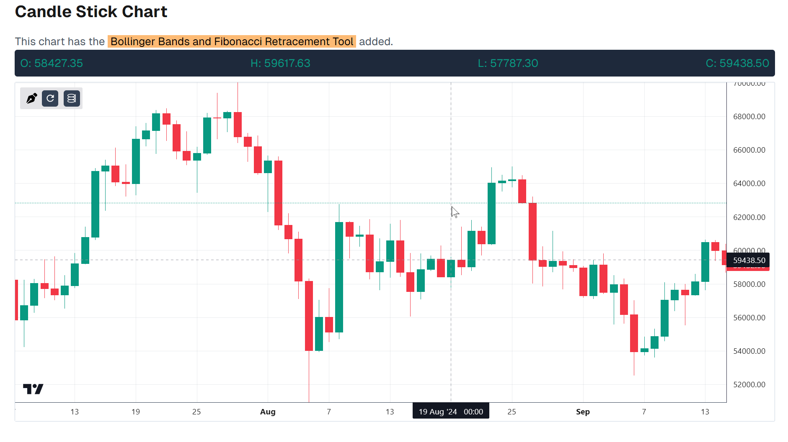

# Trading Charts

This project showcases some Trading Charts in React.

## Features

1. **Candlestick Chart**:  
    - [x] Display candlestick data for BTC-USD across multiple time frames (1m, 5m, 1h, etc.).
1. **Volume Bar Chart**:  
    - [x] Display a bar graph representing the volume traded alongside the candlestick chart.
1. **Bollinger Bands**:  
    - [x] Include Bollinger Bands as an additional indicator on the candlestick chart.
1. **Fibonacci Retracement Tool**:  
    - [x] Add a feature that allows users to draw Fibonacci retracement levels directly on the chart.
1. **Responsive Design**:  
    - [x] Ensure the charting module is responsive and user-friendly across a wide range of screen sizes, from mobile devices to desktops.

## Installation and local setup

1. Clone the repo

    ``` bash
    git clone <github repo link>
    ```

2. Add `.env.local` file and add the following variable (refer [./extra.md](./extra.md)):

    ``` bash
    NEXT_PUBLIC_BINANCE_API=<binance api endpoint>
    ```

3. Install dependencies

    ``` bash
    pnpm install
    ```

4. Start the dev server

    ``` bash
    pnpm run dev
    ```

## Instructions to use Fibonacci Retracement Tool

1. Click on the tool icon to activate the tool.
1. Click anywhere on the chart to **start drawing**, then click on the chart again to stop drawing. (No need need to hold the button down)
    - To deactivate the tool before drawing, click on the tool icon again
1. Click on the diagrams drawn to **resize or delete** them.

    - If you've clicked on a diagram once, you can simply click on it again to enable **moving it**.

1. **To move** the diagrams, double click on them, move the mouse and click again to finish the move. (No need need to hold the button down)

## ScreenShots

1. Candlestick Charts
 
1. Volume Bar Charts
 
1. Combined Charts
 
1. Bollinger Bands
 
1. Fibonacci Retracement Tool
 
